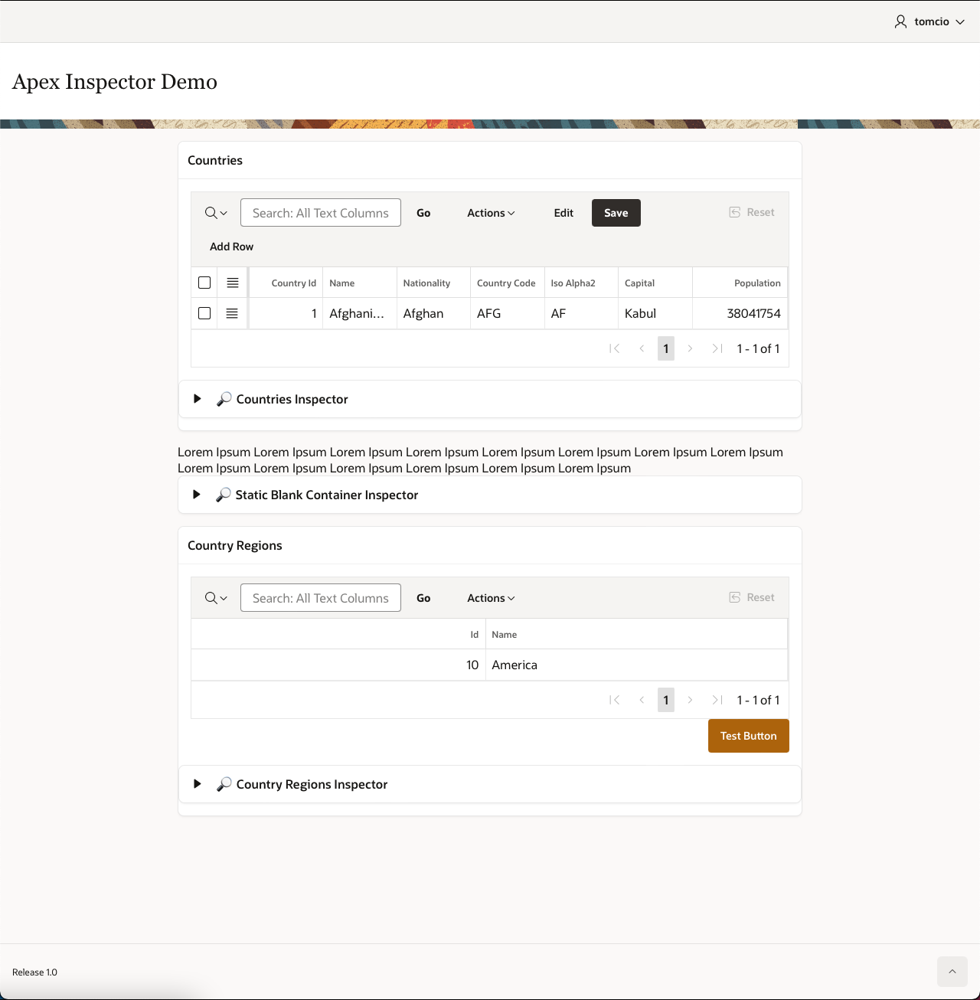
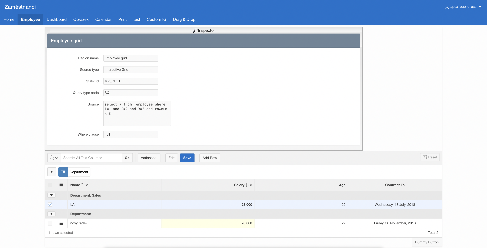

  

<h1> 🔎Inspector </h1>

## What is Inspector

Inspector is a lightweight dynamic action plugin for Oracle Application Express that adds an inspect button for regions and buttons. Inspect button opens the card with information like static id, types, querries, processes, and others.

  

  

  

  

## Demo

You can find demo application [here](https://apex.oracle.com/pls/apex/f?p=29374) 

## Supported objects

Object | Basic info | Processes | Dynamic actions
------------ | ------------- | ------------- | -------------
Region | ✅ | 🚧 | 🚧
Button | 🚧 | 🚧 | 🚧
... | | |

## Installation⚙️

1. **Download** the plugin 
2. **Import** file dynamic_action_plugin_apex_inspector.sql into your application
3. **Add dynamic action** with type "Inspector", recommended use is page load dynamic action on page 0 (affects all the pages)

## Contributing
Pull requests are welcome. For major changes, please open an issue first to discuss what you would like to change 👍

## License 📝

Licensed under the [MIT](LICENSE).