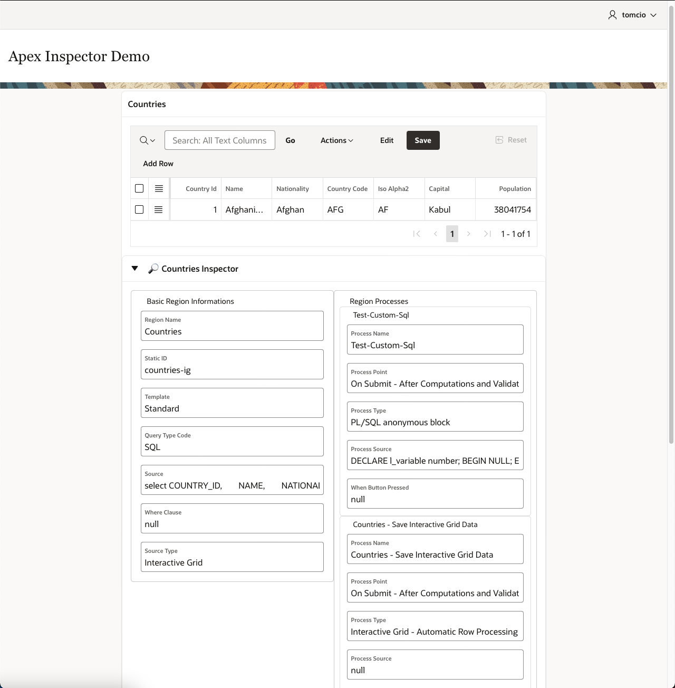

# apex-inspector
Oracle APEX Inspector

## Roadmap - TODO

> - REGION without static ID
> - ?REGION processes
> - ?REGION dynamic actions
> - BUTTON everything

  

<h1> Oracle APEX 🔎Inspector </h1>

## What is Inspector

Inspector is a lightweight dynamic action plugin that adds inspect button for regions and buttons. Inspect button opens card with informations like static id, types, querries and others.

  

  

  

  

### Supported objects

Object | Basic info | Processes | Dynamic actions
------------ | ------------- | ------------- | -------------
Region | ✅ | 🚧 | 🚧
Button | 🚧 | 🚧 | 🚧
... | | |

### Installation⚙️

1. **Download** the plugin 
2. **Import** file dynamic_action_plugin_apex_inspector.sql into your application
3. **Add dynamic action** with type "Inspector", recommended use is page load dynamic action on page 0 (affect all the pages)

## Issues
You can find issues [here](https://github.com/kucharzykt/apex-inspector/issues)

## License 📝

Licensed under the [MIT](LICENSE).